# Sample Job Setup

## What is it?

Before you can run a JasperServer report from OpCon, you must gather information about the report from the Jasper web application. This walkthrough shows how to collect the report path, Resource ID, and parameter names needed to build the OpCon command line.

## Gather report information from JasperServer

To collect the information needed to configure an OpCon job for a JasperServer report, complete the following steps:

1. Log into the Jasper application. The URL format is:

   `http://<IP address>:8080/jasperserver-pro/login.html`

   This may be different at your site. The example in this walkthrough uses the community version (JasperServer instead of JasperServer-Pro).

   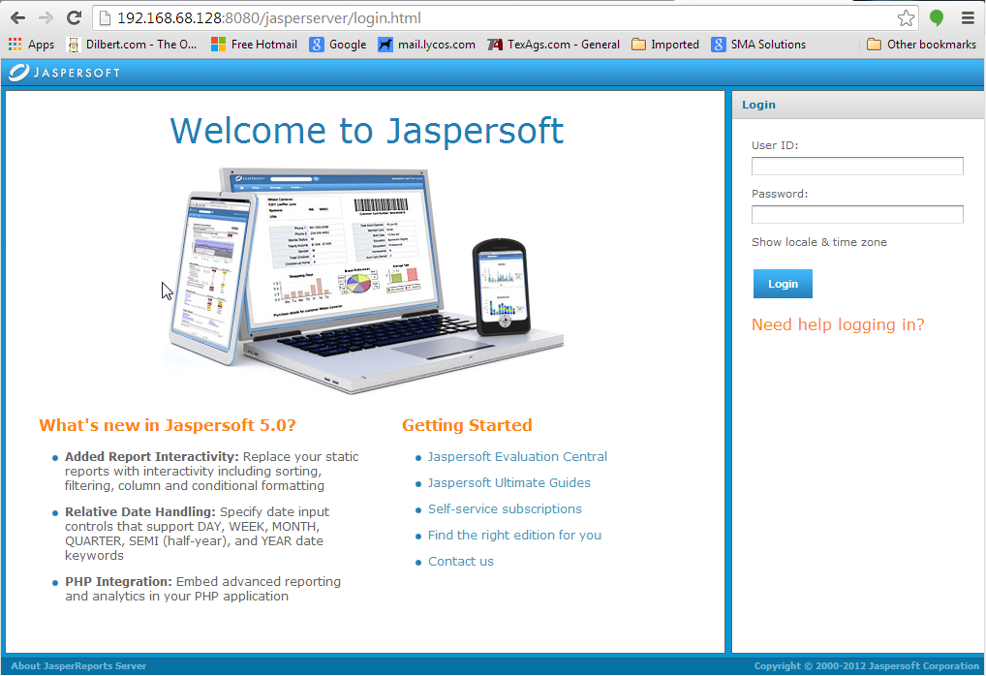

   The superuser account for the community version is `jasperadmin`.

   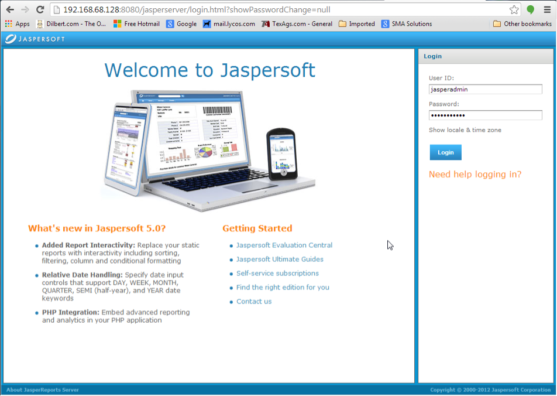

2. Right-click **View** and select **Repository** from the menu.

   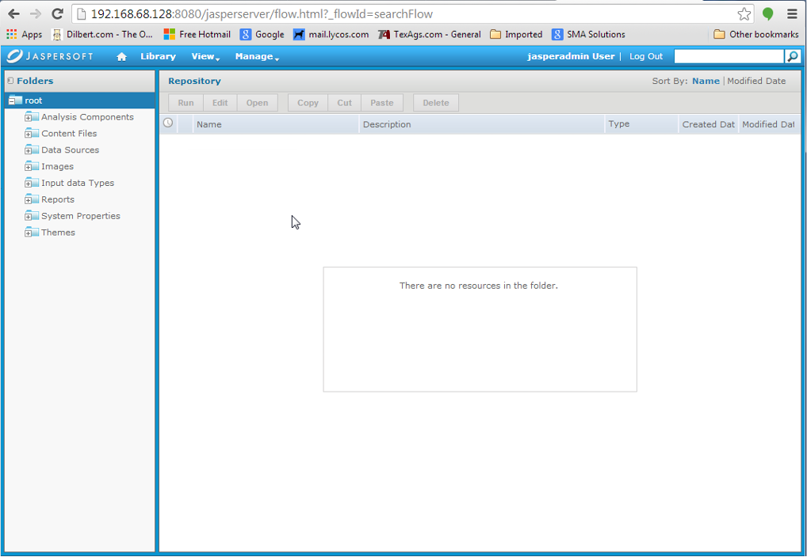

3. Open the items in the menu on the left until you see the report you want to run.

   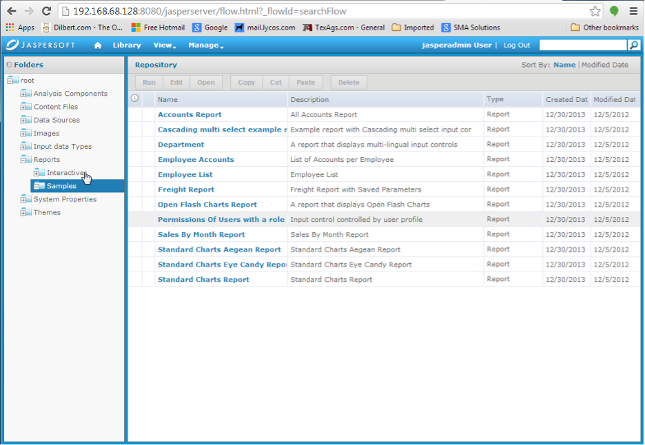

   Right-click each level in the menu on the left and select **Properties** to find the Resource ID for each level. For example, right-clicking **Reports** and selecting **Properties** shows:

   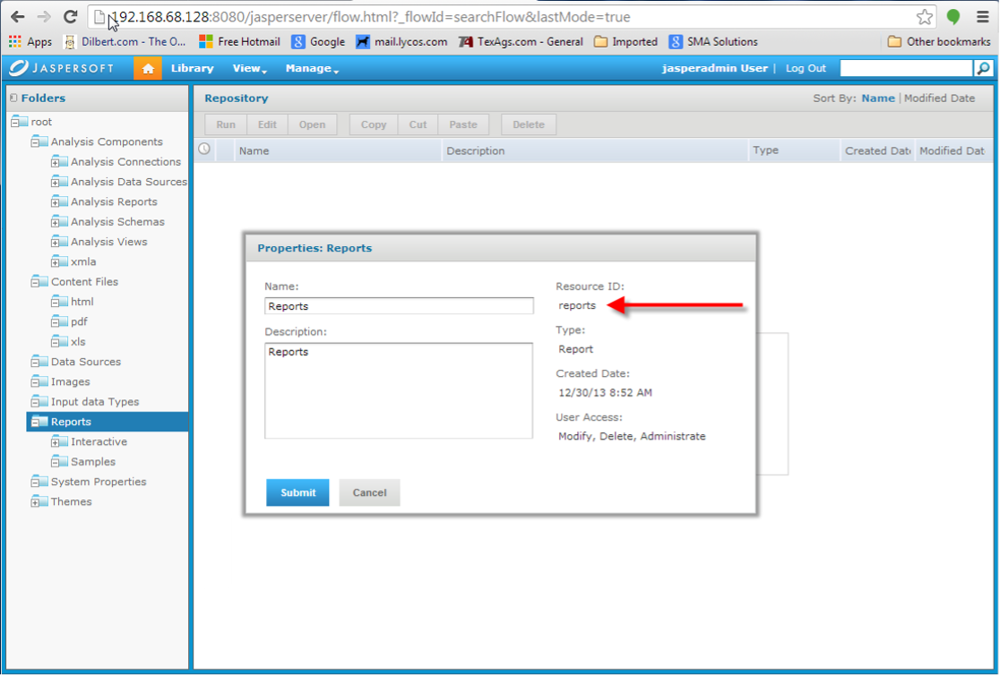

   Note the **Resource ID**. Select **Cancel** to close the dialog.

   Right-clicking **Samples** and selecting **Properties** shows:

   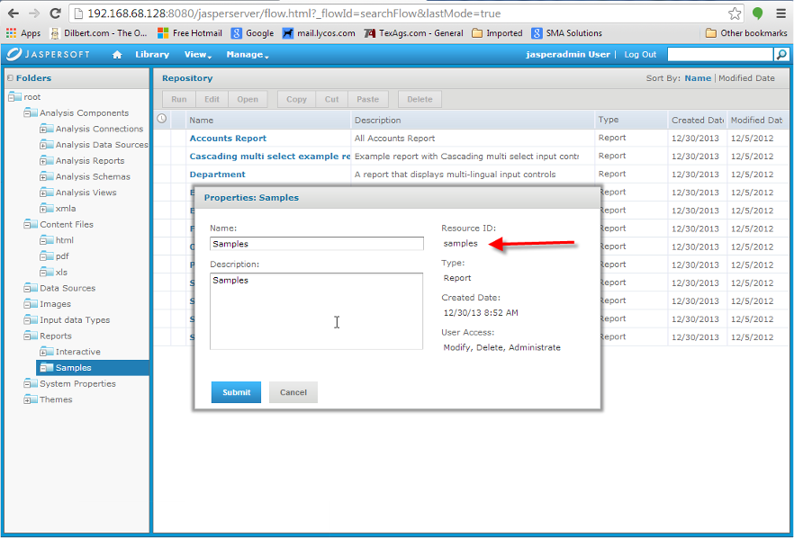

   Note the **Resource ID**. Select **Cancel** to close the dialog.

   Construct the report path by appending these Resource IDs together. This value is used with the `-ReportDirectory` command line option or in the configuration file. In this example, the path is `/Reports/Samples/`.

   :::caution

   The letter case in the report path is important. Use the exact capitalization shown in the Resource ID.

   :::

4. Select the report you want to run to highlight it, then select the **Edit** button.

   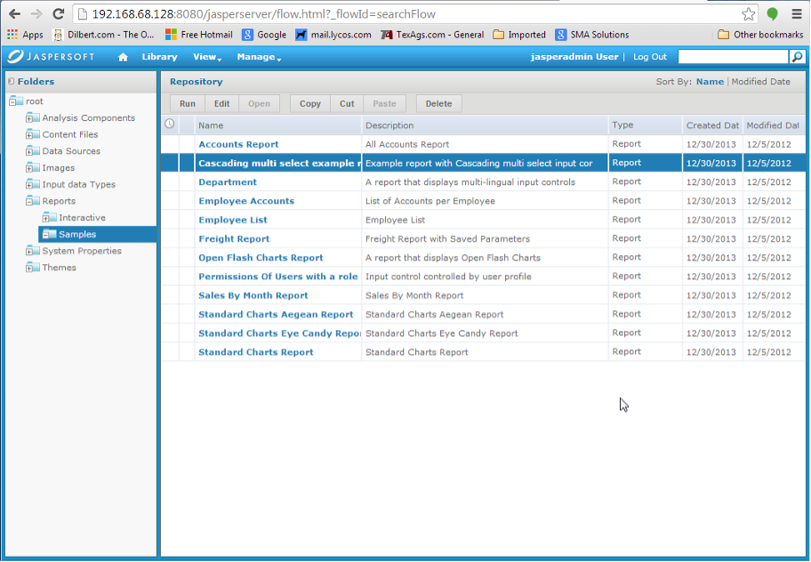

5. Review the report details.

   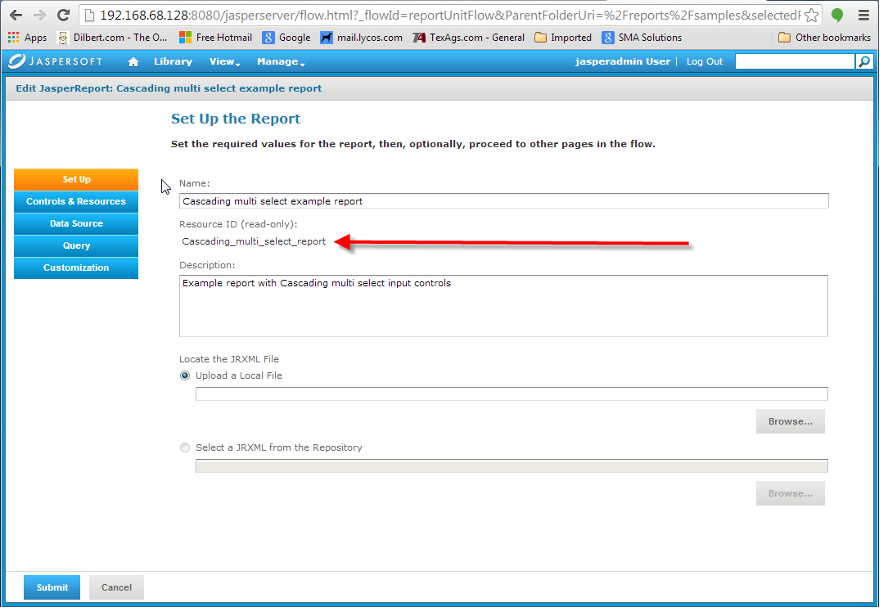

   Note the **Resource ID** for this report. This value is used with the `-ReportName` command line option.

6. Select **Controls & Resources**.

   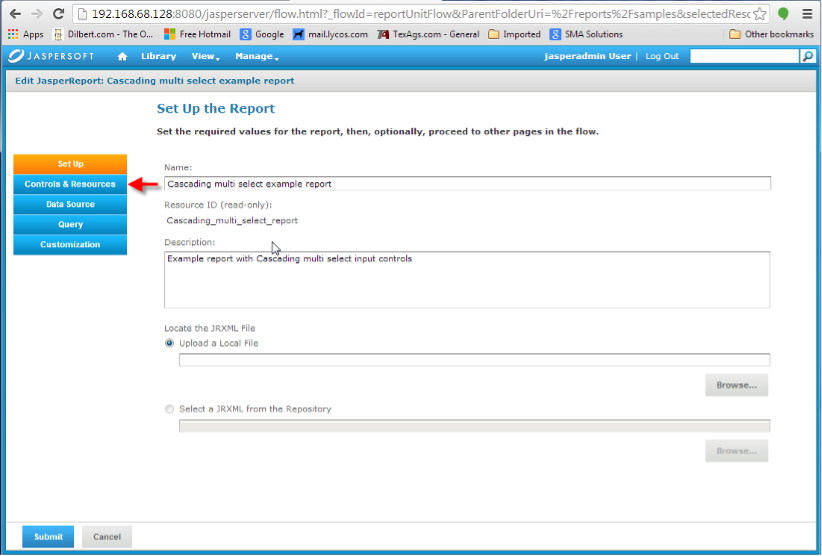

7. Review the input controls listed. Select the first input control (**Country multi select**).

   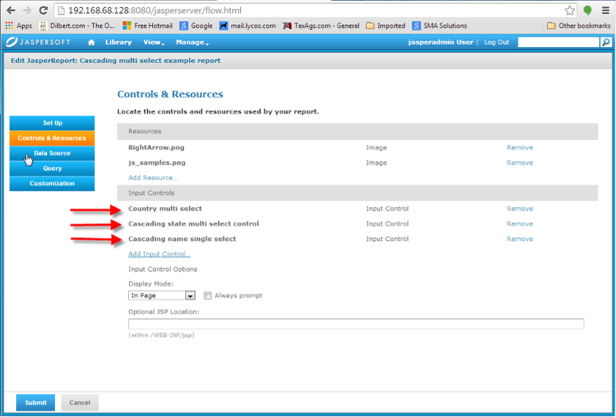

8. The input control details are displayed.

   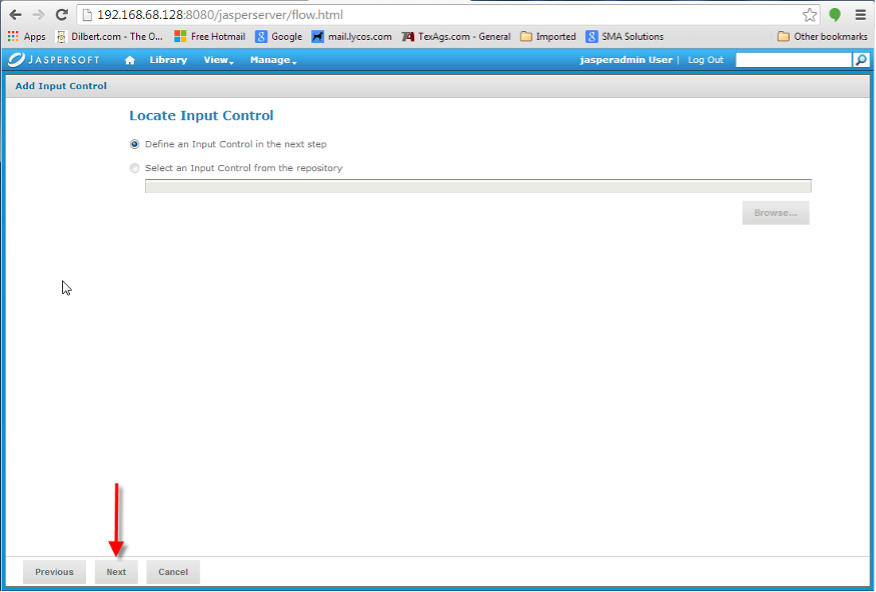

   Select **Next**.

9. Note the **Parameter Name (read-only)** field. This is the name to use in a `-Param` command line option.

   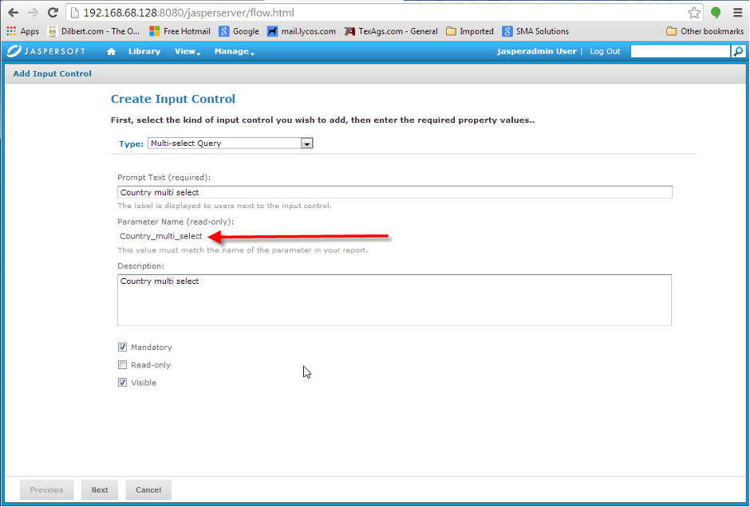

   Select **Cancel** to return to the input controls list. Repeat steps 8 and 9 for each input control listed.

At this point you have collected all the information needed to build the command line: the report name, the report directory, and all parameter names.

**Related topics:**

- [Command line options](./command-line-options.md)
- [Configuration settings](./appendix-a.md)
- [Sample execution](./appendix-b.md)
