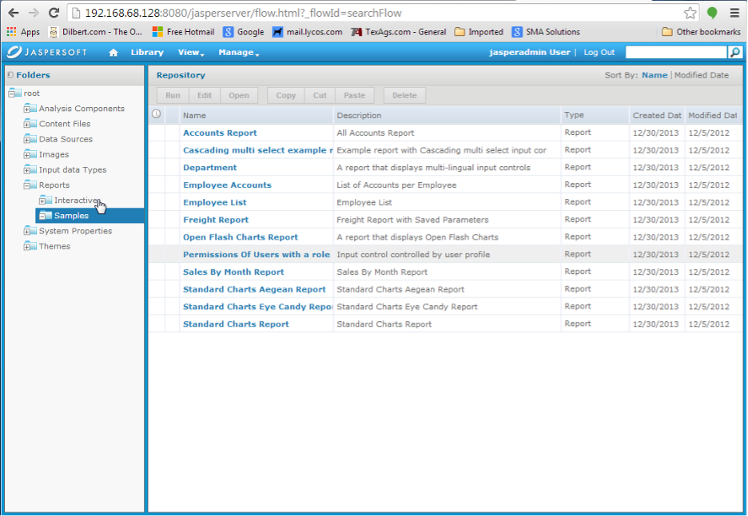

## Appendix C - Sample Job Setup

First, there is some information that must be collected in order to know what to put on the command line for OpCon.

1.	Log into the Jasper application as superuser.  The URL should be:
[`http://<I.P.>:8080/jasperserver-pro/login.html`](http://<I.P.>:8080/jasperserver-pro/login.html)

This may be different at your site.  For this example, a login to the community version (JasperServer instead of JasperServer-Pro) will be shown.  

The superuser for the communicty version is `jasperadmin`.

2.	Right-click on “View” and a drop-down menu will appear.  Click on **Repository**.

3.	Open the items on the navigation menu on the left until you see the report that you wish to run.

Right-click on each level in the navigation menu (on the left) and select **Properties**.  For example, if you right-click on **Reports** and select **Properties**, you see:

Note the **Resource ID**.  Click on **Cancel** to close the dialog.

If you right-click on Samples and select **Properties**, you will see:

Note the **Resource ID**.  Click on **Cancel** to close the dialog.

Construct the path by appending these Resource IDs together.  This will be used with the `–ReportDirectory` command line option or in the configuration file.  In this case, the path is `/Reports/Samples/`.  

:::caution 

The letter case is important!

:::

4.	Click on the line in front of the report that you wish to run to high-light it.  Then click on the button titled **Edit**.

5.	This will display the details for the report:

Write down the Resource ID for this report.  This will be used with the                 `–ReportName` command line option.

6.	Click on **Controls & Resources**

7.	Note the three Input Controls that are displayed.  Click on the first Input Control (**Country multi select**).

8.	The following screen will be displayed.

Click on **Next**.

9.	The display shown below will apear.  Note the **Parameter Name (read-only)** field.  The is the name to use in a `–Param` command line option.

Select “Cancel” to return to the screen shown in step #7.  Repeat steps #8 and #9 for all of the Input Controls.

At this point, all information to build the command line has been collected.  The report name, report directory, and all of the parameter names are known.

